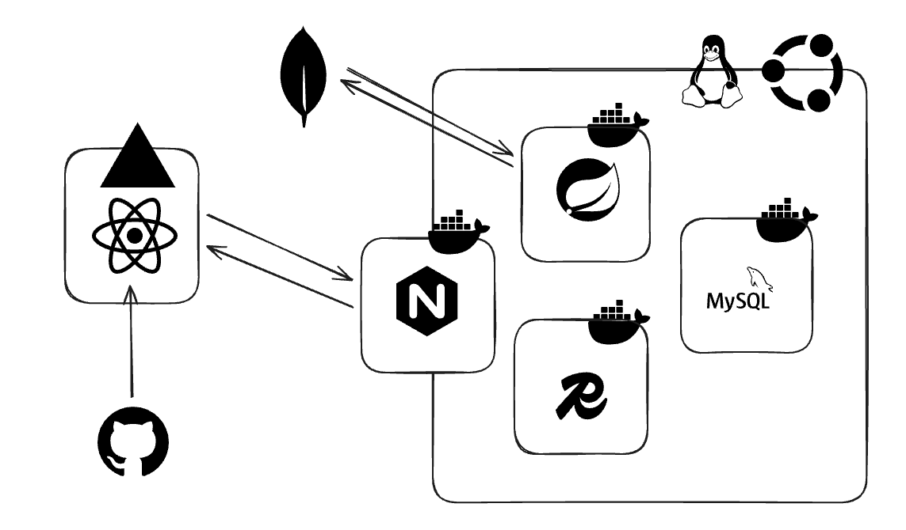

# React Recipe Finder

- CSR 구조 Recipe Finder 프론트 엔드 코드
- React 19와 TypeScript 기반의 웹 애플리케이션

## 1. 주요 기능

### 1) 통합 검색 페이지
- 재료명, 레시피명, 조리 순서 등 다양한 기준으로 레시피를 검색하고 결과를 목록으로 확인 가능
### 2) 실시간 검색 보조
- 검색어 입력 시 관련 단어를 실시간으로 추천하는 자동 완성 기능과 상세 필터 옵션을 제공
### 3) 레시피 상세 정보
- 각 레시피의 필요한 재료와 조리 방법을 상세하게 제공
### 4) 반응형 디자인
- 다양한 디바이스 환경을 고려한 Radix UI 및 Tailwind CSS 기반의 반응형 인터페이스를 구현

## 2. 아키텍처 및 구현 상세

- 의존성 주입 과 상태 관리 분리 전략 사용

### 1) 의존성 주입 (Dependency Injection, DI)

- `tsyringe` 라이브러리를 사용하여 구현
- 주요 서비스들은 싱글톤으로 관리되며 필요한 계층에 주입

-   **Container**: 서비스(레포지토리, HTTP 클라이언트)의 생명주기를 관리
-   **Resolution**: 컴포넌트는 구체적인 구현체가 아닌 추상화된 의존성을 컨테이너로부터 주입받아 사용

```typescript
// 예시: React 컴포넌트에서의 레포지토리 주입 및 사용
import { container } from "tsyringe";
import IntegratedSearchRepository from "../repository/integrated/IntegratedSearchRepository";

export default function SearchListView() {

  const repository = container.resolve(IntegratedSearchRepository);
  
  // 비즈니스 로직을 수행
  const data = await repository.integratedRecipeName(page, pageSize, term);
}
```

### 2) 상태 관리 전략 (Zustand)

- 전역 상태 관리는 `Zustand`를 사용
  - 검색어나 필터 설정과 같은 **UI 상태** 관리
- 서버 데이터 페칭 로직은 레포지토리가 담당하도록 설계

## 3. 기술 스택

-   **React 19**, **TypeScript**, **Vite (v7)**

-   **Dependency Injection**: `tsyringe`, `reflect-metadata`
-   **Routing**: `react-router-dom`
-   **State Management**: `zustand`
-   **HTTP Client**: `axios`
-   **Styling**: `Tailwind CSS`, `Radix UI` 

## 4. 프로젝트 전체 구조



### 1) 디렉토리 구조

```text
src/
├── components/         # UI 컴포넌트
├── entity/             # DTO(Data Transfer Object) 및 인터페이스
├── http/               # HTTP 클라이언트 구현 및 공통 에러 처리
├── repository/         # 데이터 접근 로직 및 API 연동 
├── stores/             # 전역 UI 상태 관리 
├── views/              # 페이지 단위 컴포넌트
└── router/             # 애플리케이션 라우팅 설정
```

## 5. 관련 링크

- [Github 백엔드 링크](https://github.com/heo-jin-dev/recipe-finder-api)